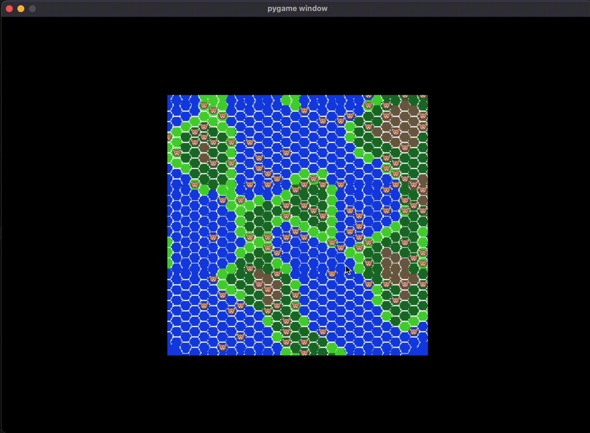

# TeddyLand
TeddyLand - an evolution simulation using pygame

**TeddyLand**, an evolution simulation with bears in Python using pygame, inspired directly by [this video](https://www.youtube.com/watch?v=H1NXC4QeTok&ab_channel=EightLittleBears).

Project for Python Basics course in uni.

# Overview
Hexagonal map is generated using perlin noise data

Each tile has a type and can be viewed.

Map generates bears which are randomly placed across the map.
They move randomly

## Rules

### Bear

Each bear will have a couple of parameters, determining his behavior and survival in the simulation.

### Map

### Evolution

# Setup and installation
It's best practice to create a virtual environment and install from requirements.txt:
[python docs for venvs](https://docs.python.org/3.9/library/venv.html)
After activating the venv:
*pip3 install -r /path/to/requirements.txt*

# Running
python3 main.py