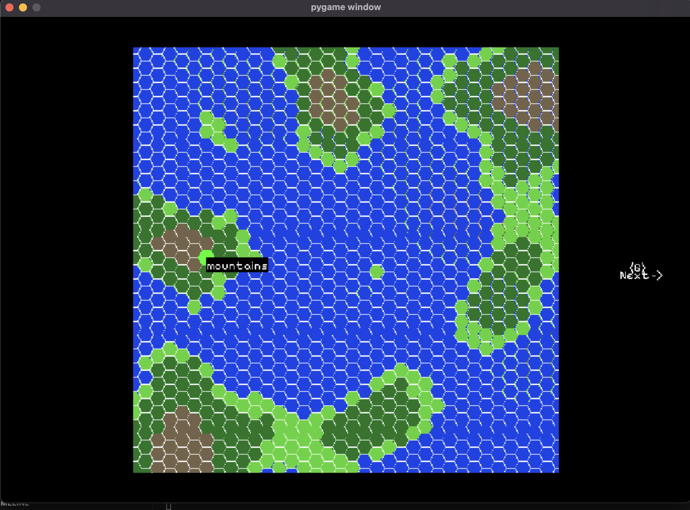

# PPWJP_Projekt

**MisioLand**, an evolution simulation with bears in Python using pygame, inspired directly by [this video](https://www.youtube.com/watch?v=H1NXC4QeTok&ab_channel=EightLittleBears).

Project for Python Basics course in uni.

# Overview

For now, hexagonal map is generated using perlin noise data

## Rules

### Bear

### Map

### Evolution

# Setup and installation

# Running